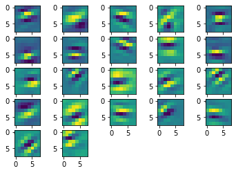

# Learnings as of August 23rd, 2020
## Key Findings:
1. Building a graph by setting each feature to a node and adding edge weights whenever the two features appear in consecutive frames can be an effective way to model the 'closeness' of features if clustered correctly.
    * The approach above does not yield multiple connected components (easily). So we must cluster with other approaches. 
1. Spectral Clustering on the aforementioned graph leads to clusters of interpretably similar features as shown in the image below.

Example Cluster:

## Pooling
In order to pool we need to:
1. Create a graph
1. Cluster it
1. Embed the clustering appropriately

Nothing that steps 2. and 3. are interchangeable, at the moment we know how to 1. and 2. and are exploring options for the third. With the clusters we already have, one option is to run LLE to embed the clusters as is. Another promising option is to do a Spectral embedding on the graph and run a simple k-means algorithm to cluster the embeddings. To verify that clustering spectral embeddings gives us the results we desire, we need to approximate the inverse of a spectral embedding (via decoder) and see if the space in between two features is an interpretable meld of the two. If this is so, finding the average via k-means will give us a good representation of the cluster as a whole.
## Work for the future
1. Investigate Spectral Embedding and k-means
    * Verify that a decoder provides the interpretable midway features we expect (as described above)
2. Investigate LLE to embed the clusters we already have